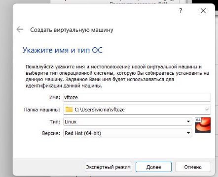
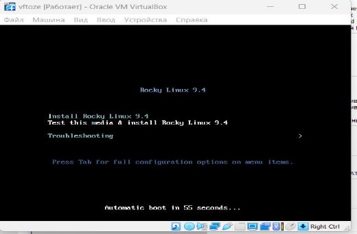
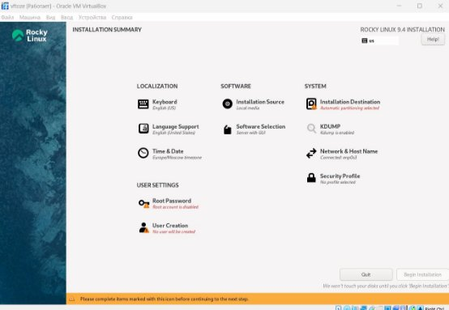
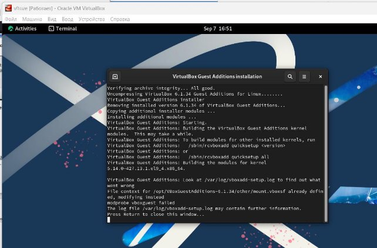
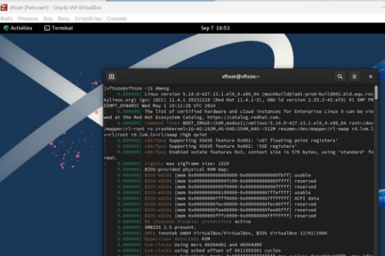
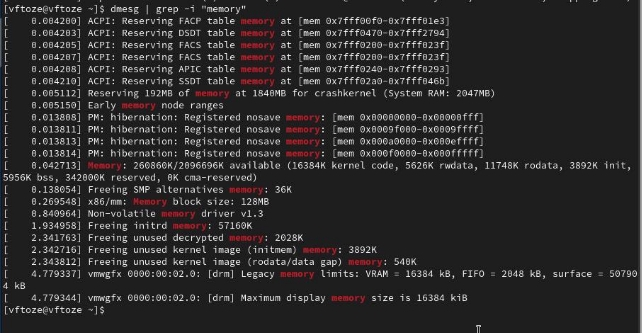

**РОССИЙСКИЙ УНИВЕРСИТЕТ ДРУЖБЫ НАРОДОВ** 

**Факультет физико-математических и естественных наук Кафедра прикладной информатики и теории вероятностей** 

**ОТЧЕТ**  

**ПО ЛАБОРАТОРНОЙ РАБОТЕ № 1** 

*дисциплина:  Информационная безопасность*  

Студент:      Тозе Виктор Ф         Группа: НФИбд-02-21         

**МОСКВА** 2024 г. 

**Цель работы** 

`  `Цель работы Целью данной работы является приобретение практических навыков установки операционной системы на виртуальную машину, настройки ми  нимально необходимых для дальнейшей работы сервисов. 

**Техническое обеспечение** 

Лабораторная работа подразумевает установку на виртуальную машину VirtualBox (https://www.virtualbox.org/) операционной системы Linux (дистрибутив Rocky (https://rockylinux.org/) или CentOS (https:// 

www.centos.org/)). 

Выполнение работы возможно как в дисплейном классе факультета физико-математических и естественных наук РУДН, так и дома. Описание выполнения работы приведено для дисплейного класса со следующими ха  рактеристиками: 

- Intel Core i3-550 3.2 GHz, 4 GB оперативной памяти, 20 GB свободного места на жёстком диске; 
- ОС Linux Gentoo (http://www.gentoo.ru/); 
- VirtualBox верс. 6.1 или старше; 
- каталог с образами ОС для работающих в дисплейном классе: /afs/dk.sci.pfu.edu.ru/common/files/iso/. 

Окно «Имя машины и тип ОС» 

Окно настройки установки образа ОС 

Запуск образа диска дополнений гостевой ОС 

Дождитесь загрузки графического окружения и откройте терминал. В окне  терминала  проанализируйте  последовательность  загрузки  системы,  выполнив команду dmesg. Можно просто просмотреть вывод этой команды: 

dmesg | less 

Можно  использовать  поиск  с  помощью  grep:  dmesg  |  grep  -i  "то,  что  ищем" Получите следующую информацию.  

1. Версия ядра Linux (Linux version). 

2. Частота процессора (Detected Mhz processor) 

3. Модель процессора (CPU0). 

4. Объем доступной оперативной памяти (Memory available) 

5. Тип обнаруженного гипервизора (Hypervisor detected). 

6. Тип файловой системы корневого раздела. 

**Ответы**: 

1. Учётная запись пользователя содержит следующую информацию: имя пользователя (логин), идентификатор пользователя (UID), идентификатор группы (GID), домашний каталог и команду оболочки, которая будет запускаться после входа в систему. 
1. Команды терминала: 
- Для получения справки по команде: `man <имя команды>` (например, `man ls ). 
- Для перемещения по файловой системе: `cd <путь>` (например, `cd /var/tmp ). 
- Для просмотра содержимого каталога: `ls <путь>` (например, `ls /var/tmp ). 
- Для определения объёма каталога: `du -sh <путь>` (например, `du -sh /var/tmp ). 
- Для  создания  каталогов:  `mkdir  <имя  каталога>`  (например,  `mkdir 

/var/tmp/new\_folder ). 

`      `Для  удаления  каталогов:  `rmdir  <имя  каталога>`  (например,  `rmdir /var/tmp/new\_folder ). 

`      `Для создания файлов: `touch <имя файла>` (например, `touch /var/tmp/new\_file ).       Для удаления файлов: `rm <имя файла>` (например, `rm /var/tmp/new\_file ). 

- Для  задания  прав  на  файл  или  каталог:  `chmod  <права>  <файл/каталог>` 

(например, `chmod 755 /var/tmp/new\_file ). 

- Для просмотра истории команд: `history . 
3. Файловая система — это способ организации данных на носителе информации, такой как жёсткий диск или SSD. Примеры: 
- \*\*ext4\*\*: файловая система, часто используемая в Linux, поддерживает большие 

файлы и надёжна. 

- \*\*NTFS\*\*:  основная  файловая  система  Windows,  поддерживающая  большие 

файлы и тома, с функциями восстановления. 

- \*\*FAT32\*\*: устаревшая файловая система, используется для флеш-накопителей и 

съёмных дисков, ограничение на размер файлов — 4 ГБ. 

4. Чтобы посмотреть, какие файловые системы подмонтированы в ОС, используется команда: `df -h . 
4. Для удаления зависшего процесса используется команда: `kill <PID>` (например,  kill 1234`), где `PID  — идентификатор процесса. 
